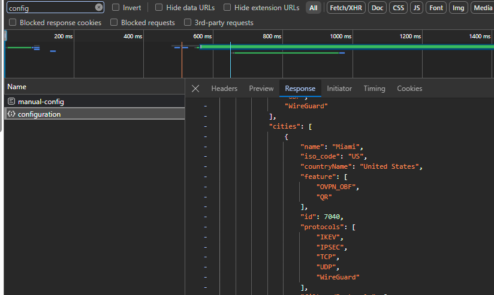

[](https://github.com/Rikpat/purevpnwg/actions/workflows/build-release.yml)

# PureVPN WireGuard fetcher

A tool written in go serving to automatically fetch WireGuard configuration from PureVPN, countering the 30 minute policy they have.

Possible use-cases include running in a startup script for wireguard service, or as a startup container in kubernetes pod. 

Because PureVPN doesn't expose their API or have any API keys for customers, I had to reverse engineer the whole manual process and use a headless browser to get the file.

> Disclaimer:
> 
> It's first goal was to be a fully fledged CLI tool for doing anything related to PureVPN's WireGuard integration, and as a learning project for Go CLI program for me. I've since moved on and don't have as much time so I've just released the *full* command that does the whole thing. I may someday finish other goals. They include:
>
> - Login command - logs user in using username + password ✅
> - Update command - creates or updates wireguard configuration file ✅
> - Config command - select subscription or server using interactive console gui - including filtering servers by supported protocols
> - Config file - persisiting configuration for subsequent uses ✅
> - Storing user cookies to prevent having to log in every time and persisting username/password in config file - partially done, the cookies should have a long expiration date but sometimes fail randomly
> - Env variables for config - useful for docker container and full command - see docker section ✅
> - Docker container ✅

## Docker

Goal of the docker container is running as Kubernetes initContainer for WireGuard pods, or just a simple way of generating the config. It is based on env variables, but config file is still a possible choice.

To get the file where needed mount the */out/* directory to volume. 

Env variables:

| Variable                      | Description                                         | Required                                            | Default                                             | Config Equivalent     |
|-------------------------------|-----------------------------------------------------|-----------------------------------------------------|-----------------------------------------------------|-----------------------|
| PUREVPN_USERNAME              | PureVPN username (email)                            | x                                                   |                                                     | username              |
| PUREVPN_PASSWORD              | PureVPN password                                    | x                                                   |                                                     | password              |
| PUREVPN_SERVER_COUNTRY        | PureVPN server country                              |                                                     | DE (in docker only)                                 | server.country        |
| PUREVPN_SERVER_CITY           | PureVPN server city                                 |                                                     | 2762 (in docker only)                               | server.city           |
| PUREVPN_SUBSCRIPTION_ID       | PureVPN subscription ID                             | only if multiple, prompted if interactive shell     | fetched if only one                                 | subscription.username |
| PUREVPN_SUBSCRIPTION_PASSWORD | PureVPN subscription password (used for connecting) |                                                     | fetched automatically, storing reduces calls by one | subscription.password |
| PUREVPN_DEVICE                | Platform, used in call for wireguard config         |                                                     | linux                                               | device                |
| PUREVPN_WIREGUARD_FILE        | Output file to generate                             |                                                     | wg0.conf (/out/wg0.conf in docker)                  | wireguardFile         |

## Running locally

Create config.yml file or environment variables with values as described in table in docker section. At minimum you have to specify *username*, *password*, *server.country* and *server.city*. Then run `purevpnwg full`.

Example yaml file:

```yaml
username: email@example.com
password: <password>
server: # Set to a server you want to connect to
  country: US 
  city: 2762
subscription:
  username: purevpn********* # If you have multiple subscriptions in your account
wireguardFile: wg0-p2p.conf # If you want to have a different file location
```

> You can get server country and city id in multiple ways, for example in configuration response in your browser (taken from manual configuration page):
>
> 